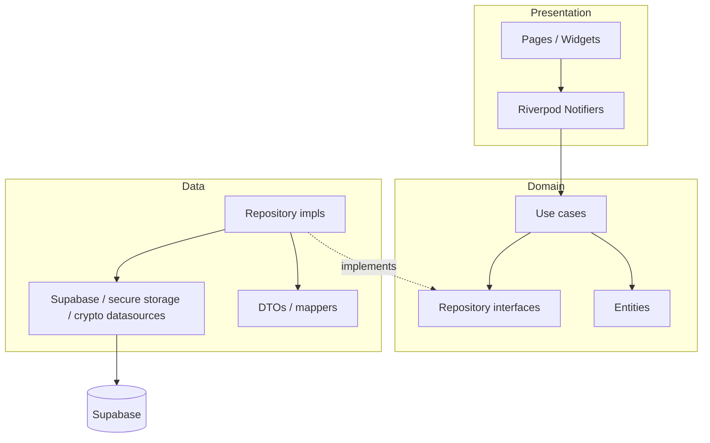
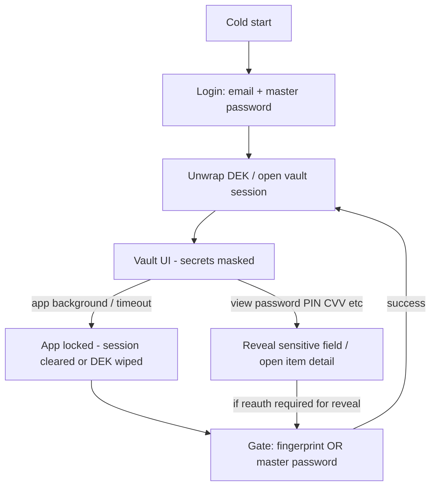
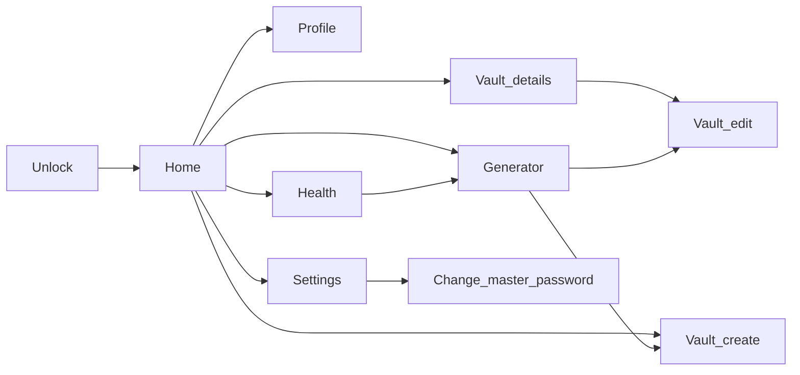

# Nucleus — Flutter + Supabase Password Manager

## Decisions locked

- **Frontend architecture:** Clean Architecture (feature-first folders; dependency rule inward)
- **State management:** Riverpod (`flutter_riverpod` + `riverpod_annotation` / codegen) in the presentation layer
- **Platform:** Android first (iOS later; keep code cross-platform-ready)
- **Supabase:** You create the project and apply SQL I provide; share **URL + anon key** only (never service role in the app)
- **Avatars:** 60 preset **PNG** assets you provide; custom gallery upload also supported
- **Loading:** Brand-matched Lottie at `assets/animations/loading.json` (created for Nucleus palette — not `ColorScheme.fromSeed`)
- **Re-auth gate:** Full login = email + master password; app resume / vault open / reveal secrets = master password **or** fingerprint
- **Settings vs Profile:** Settings owns appearance, lock timers, re-auth grace, change master password, lock now, logout. Profile is a separate page from Home (avatar, name, read-only email). No profile link on Settings.
- **Navigation:** After unlock, Home is the root. Double-back on Home exits; any other page pops the stack.

## Color system (final — hand-authored, not fromSeed)

Direction: **Rose vault** — cool neutral canvases, sharp rose-red actions, calm surfaces. Primary brand `#F21649`. No purple gradients, no cream/terracotta, no neon glow.

### Light


| Token           | Hex         | Use                                           |
| --------------- | ----------- | --------------------------------------------- |
| `primary`       | `#F21649`   | CTA, active nav, FAB, focus                   |
| `primaryHover`  | `#D4143F`   | Pressed primary                               |
| `primarySoft`   | `#FFE5EC`   | Chips, selected rows, soft fills              |
| `onPrimary`     | `#FFFFFF`   | Text/icons on primary                         |
| `bg`            | `#F7F8FA`   | Scaffold                                      |
| `surface`       | `#FFFFFF`   | Sheets, fields, lists                         |
| `surfaceMuted`  | `#EEF0F3`   | Input fill / dividers soft                    |
| `border`        | `#E2E5EB`   | Hairlines                                     |
| `textPrimary`   | `#14151A`   | Titles, body                                  |
| `textSecondary` | `#6B7280`   | Hints, meta                                   |
| `textTertiary`  | `#9CA3AF`   | Masked dots, placeholders                     |
| `success`       | `#0D9F6E`   | Health strong                                 |
| `warning`       | `#D97706`   | Health weak                                   |
| `danger`        | `#E11D48`   | Destructive (close to brand, distinct enough) |
| `overlay`       | `#14151A99` | Unlock scrim                                  |


### Dark


| Token           | Hex         | Use                                  |
| --------------- | ----------- | ------------------------------------ |
| `primary`       | `#FF4D73`   | Slightly lifted for contrast on dark |
| `primaryHover`  | `#F21649`   | Pressed                              |
| `primarySoft`   | `#3D1524`   | Soft brand container                 |
| `onPrimary`     | `#FFFFFF`   |                                      |
| `bg`            | `#0F1014`   | Scaffold                             |
| `surface`       | `#1A1B22`   | Lists, sheets                        |
| `surfaceMuted`  | `#24262F`   | Inputs                               |
| `border`        | `#2E303A`   |                                      |
| `textPrimary`   | `#F4F4F5`   |                                      |
| `textSecondary` | `#A1A1AA`   |                                      |
| `textTertiary`  | `#71717A`   |                                      |
| `success`       | `#34D399`   |                                      |
| `warning`       | `#FBBF24`   |                                      |
| `danger`        | `#FB7185`   |                                      |
| `overlay`       | `#000000B3` |                                      |


Theme is built with explicit `ColorScheme` + custom `AppColors` extension (and text/button themes). **Do not use `ColorScheme.fromSeed`.**

### Sample UI (design preview)

Previews generated for plan review (see chat / `assets/` previews):

- Login (light) — brand wordmark, email + master password, primary Unlock
- Vault home (dark) — list + bottom nav + rose FAB
- Unlock sheet — fingerprint **or** master password when re-opening app / revealing secrets

### Loading Lottie

At bootstrap, ship `assets/animations/loading.json`: a minimal **concentric pulse / soft vault ring** using `#F21649`, `#FF4D73`, and `#FFE5EC` (light-friendly; still reads on dark surfaces). Shared `VaultLoader` widget; no spinner defaults.

## Architecture overview




**Clean Architecture rules (enforced in structure):**

- **Domain** has zero Flutter/Supabase imports — entities, repository contracts, use cases only
- **Data** implements domain repositories; maps DTOs ↔ entities; owns Supabase, secure storage, crypto adapters
- **Presentation** owns UI + Riverpod notifiers/controllers; calls use cases only (not datasources)
- **Core / shared** — theme, responsive `Scale`, errors, DI wiring, routing shell; no feature business rules

**Feature slice (example `vault`):**

```
features/vault/
  domain/     entities, vault_repository.dart, use_cases/
  data/       vault_remote_datasource, vault_repository_impl, mappers
  presentation/  pages, widgets, providers
```

Same pattern for `auth`, `unlock`, `profile`, `generator`, `health`, `settings`.

**Password health computation (shared across Vault home + Health tab):**

- Health scoring (weak / reused / old / fine) runs as part of the **same in-session decrypt pass** that feeds the Vault home list — no extra decrypt pass or Supabase round trip.
- Logic lives in `features/health/domain/` as a reusable use case (e.g. `EvaluatePasswordHealth` / batch evaluator over decrypted password items). **Presentation** in both `vault` and `health` calls this use case; no duplicated heuristics in either feature.
- A shared Riverpod provider/notifier (owned by `health` presentation, consumed by `vault` presentation) holds computed health state per item for the current session; both Vault home and Health tab read from the same source.

## Project bootstrap

- Create Flutter app in repo root (`nucleus` / `passmngr`)
- Android min SDK suitable for biometrics + secure flags
- Env via `--dart-define` or `flutter_dotenv` (`.env` gitignored; `.env.example` committed)
- Packages (core): `flutter_riverpod`, `riverpod_annotation`, `go_router`, `supabase_flutter`, `flutter_secure_storage`, `local_auth`, `cryptography` (or PointyCastle), `flutter_svg`, `lottie`, `image_picker`, `freezed` + `json_serializable`, screenshot restriction package (`screen_protector` / equivalent for `FLAG_SECURE`)
- Shared loading widget wraps the provided Lottie JSON; used for auth, vault fetch, profile save, etc.

## Zero-knowledge encryption (v1)

Your approach is sound and supports master-password change. Concrete crypto (simple, strong, not over-engineered):


| Piece        | Choice                                                                                     |
| ------------ | ------------------------------------------------------------------------------------------ |
| KDF          | Argon2id (via `cryptography`) — master password + per-user salt → KEK                      |
| DEK          | 32-byte random key generated at signup                                                     |
| Wrap         | Encrypt DEK with KEK (AES-256-GCM); store `encrypted_dek` + `salt` + KDF params on profile |
| Vault fields | AES-256-GCM with DEK; store ciphertext + nonce (and optional AAD = item id/type)           |
| In-memory    | DEK held only in a Riverpod session notifier after unlock; cleared on lock/logout          |
| Auth         | Same master password used for Supabase Auth sign-in (email + password)                     |


**Signup flow:** Auth signup → generate salt + DEK → wrap DEK → insert `profiles` row → unlock session.  
**Login flow:** Auth sign-in → load profile wrap → derive KEK → unwrap DEK → session ready.  
**Master password change (implemented in Settings):** unwrap DEK with old password → re-wrap with new → update Auth password + profile wrap in one coordinated flow. UI: `/settings/change-master-password`.

Server stores only ciphertext for vault payloads; RLS ensures users only touch their rows.

## Supabase schema (you apply)

I will deliver SQL under `supabase/migrations/` covering:

`**profiles**`

- `id` UUID PK → `auth.users.id`
- `name` text
- `email` text
- `avatar_type` enum/`text` (`preset` | `custom`)
- `avatar_preset_id` text nullable
- `avatar_path` text nullable (Storage path)
- `theme_preference` text (`system` | `light` | `dark`)
- `encrypted_dek` text/bytea
- `kek_salt` text/bytea
- `kdf_params` jsonb (memory/iterations/parallelism for Argon2)
- `created_at` / `updated_at` timestamptz

`**vault_items**` (single polymorphic table — easier ZK + future types)

- `id` UUID PK
- `user_id` UUID FK → profiles
- `item_type` text/enum: `password` | `bank_account` | `atm_card` | `note`
- `encrypted_payload` text (AES-GCM ciphertext of JSON fields below)
- `nonce` text
- `created_at` / `updated_at` timestamptz  
- Optional non-sensitive index aids only if needed later; v1 encrypts **all** fields including label (list decrypts client-side after unlock)

**Payload field contracts (JSON before encrypt):**

- **password:** `label`*, `url`, `username`*, `password*`, `notes`, `password_changed_at` (ISO-8601 timestamp; set on create; updated **only** when `password` changes — not on label/username/notes edits)
- **bank_account:** `label`*, `bank_name`*, `account_type*`, `account_no*`, `ifsc*`, `micr`, `notes`
- **atm_card:** `label`*, `bank_name`*, `name_on_card*`, `card_type*` (credit/debit), `card_no*`, `cvv*`, `expiry_date*`, `atm_pin`, `upi_pin`, `notes`
- **note:** `label`*, `notes`*

`password_changed_at` lives inside the encrypted JSON payload (not a `vault_items` column). Vault create/update mappers set it to `now` on first password set and bump it only when the decrypted `password` value differs from the previous value.

**Storage:** private bucket `avatars` — path `{user_id}/...`; RLS: owner read/write.  
**RLS:** all tables `auth.uid() = user_id` / `id`.  
**Triggers:** `updated_at` auto-update.

You will: create project → run migration SQL → create publishable key → put URL/publishable key in `.env`.

## App features — Phase 1 (build now)

### Auth & unlock (session model)




- **Signup / first login:** email + master password (Supabase Auth) → derive KEK → unwrap DEK → vault session open
- **Later app opens** (Supabase session may still be valid): do **not** ask for email again; show **Unlock** screen — **fingerprint or master password** only
- **Opening a vault item / viewing masked secrets** (password, PIN, CVV, account numbers, etc.): values stay masked until user passes **fingerprint or master password** (biometric preferred if enrolled; password always available fallback)
- **Auto-lock** (Settings, device-local prefs): lock after foreground inactivity — 30 seconds, 1 minute, 5 minutes, 15 minutes, 30 minutes, or **While using app** (no foreground timeout). App going to background still locks. **Lock vault now** on Settings wipes the in-memory DEK and shows Unlock.
- **Re-auth for secrets** (Settings, device-local prefs): Every time, 30 seconds, 1 minute, 2 minutes, 5 minutes — how long reveal/copy may skip fingerprint or master password after a successful gate.
- Device stores biometric-protected unlock material in `flutter_secure_storage` after first successful master-password unlock; never store master password in plaintext

### Profile (separate from Settings)

Pushed from **Home only** (`/profile`). Back pops to Home. Not linked from Settings.

- **Avatar:** show selected preset or custom photo; **Choose avatar** (60 PNGs in `assets/avatars/`, ids `1`…`60`) or **Upload photo** (gallery → Storage `avatars` bucket)
- **Name:** editable; save to `profiles.name`
- **Email:** from auth; **non-editable**
- Loading states use brand Lottie `assets/animations/loading.json`
- Do **not** put theme, auto-lock, change master password, lock, or logout here

### Settings

Bottom-nav tab. No profile name/avatar/email. Options:

- **Appearance:** System, Light, Dark — apply `ThemeMode` immediately; persist to `profiles.theme_preference`
- **Auto-lock vault:** 30 seconds, 1 minute, 5 minutes, 15 minutes, 30 minutes, While using app
- **Re-auth for secrets:** Every time, 30 seconds, 1 minute, 2 minutes, 5 minutes
- **Password age threshold:** 90 days or 180 days (device-local `SharedPreferences`, same pattern as auto-lock / re-auth grace). Default **90**. Used by Health **Old** filter (`password_changed_at` older than threshold).
- **Change master password:** implemented (unwrap/re-wrap DEK + Auth password update)
- **Lock vault now:** instant lock → Unlock screen (not login)
- **Log out:** confirm → clear session → login

Auto-lock and re-auth timers are local (`SharedPreferences`). Theme syncs to Supabase profile.

### Vault

- List / search (client-side after decrypt) / filter by type
- CRUD for all four item types
- Sensitive fields **always masked by default**; reveal requires fingerprint or master password per gate rules above
- Timestamps shown in device timezone (`DateTime` local conversion from UTC)
- **Health badges on home list:** each password-type row shows a small indicator (colored dot or icon) for weak, reused, old, or fine — same thresholds/logic as the Health tab (strength rules, reuse detection, `password_changed_at` age check). Computed from the shared session health state (see architecture note above), not re-evaluated separately when opening Health.

### Password generator

- Length, lower/upper/digits/symbols toggles
- Copy to clipboard; “Save as vault item” → password form prefilled (`generator -> vault item form`)
- After a successful save, **replace** the stack with `home -> vault item details` (not leave generator under the form)

### Password health

- **Role:** dedicated **triage/fix view** — not the only place strength/reuse/age is visible. Vault home provides at-a-glance badges; Health tab is for filtering, sorting, grouping, and fixing issues.
- **Shared health state:** strength/reuse/age scoring happens once per session during the vault list decrypt pass; Health tab and Vault home both consume the same Riverpod provider (see architecture note). Pure presentation-layer wiring — no duplicate health-check logic.
- Strength rules (length, charset variety, common-password check against a small local denylist); reuse detection among decrypted passwords in session
- Per-item health badge on password-type vault items (vault home list and detail)
- **List item identification:** each Health row displays `{label} — {identifier}` (e.g. `Netflix — john@mail.com`). Identifier = `username` if non-empty; else URL host from `url`. If label + identifier still collide, append a disambiguator (e.g. last-updated date from `updated_at`).
- **Fix now:** weak and reused items show a **Fix now** action on the row (and/or in item detail). Tap opens **Generator** pre-filled, then **vault item form in edit mode** for the **same existing item** (reuse `generator -> vault item form` pattern via `/vault/edit/:id` with existing item + generated password — not `/vault/new`). On save, **update** the existing item (not create); navigation stack replaces to `home -> vault item details` (same replace behavior as generator save).
- **Filter:** segmented control at top — **All / Weak / Reused / Old**. **Old** = `password_changed_at` older than Settings password-age threshold (default 90 days).
- **Stat shortcuts:** replace static Checked/Weak/Reused tiles with **tappable** shortcuts that apply the corresponding filter to the list below (e.g. tap **Weak** applies Weak filter).
- **Reused grouping:** when showing reused items (Reused filter or reused rows under All), cluster items sharing the same password under a **Reused password** group header instead of a flat list.

### Hardening / UX polish

- App-wide screenshot restriction (Android `FLAG_SECURE`)
- Explicit **Rose vault** palette from Color system section (no `fromSeed`)
- Responsive: single `Scale` helper (base width e.g. 390) applied to spacing, type, radii — no raw magic numbers in widgets
- Modern SVG icon set (`flutter_svg` + `assets/icons/`); no Material default icons as primary UI icons
- Minimal, convenience-first UI: clear vault home, FAB/add sheet by type, detail with masked secrets

### Navigation (`go_router`)

Auth-session present but vault locked → **unlock** route, not login.

After login/unlock, **Home is the root** of the app (`/home` in the bottom-nav shell: Home, Generator, Health, Settings). Overlay routes sit above the shell (bottom bar hidden): `/profile`, `/vault/:id`, `/vault/new`, `/vault/edit/:id`, `/settings/change-master-password`. Prefer `push`/`pop` over `go` for in-app flows.

**Android / system back:**

- On **Home** (no overlay): first back → “Press back again to exit”; second back within ~2s exits the app
- On **Generator / Health / Settings** with nothing pushed: back returns to **Home** (does not exit)
- On any **pushed** page: back **pops** to the previous page in the stack

**Page stacks** follow navigations from widgets on that page:




- `home -> profile`
- `home -> vault item details -> vault item edit`
- `home -> vault item create`
- `home -> generator -> vault item form` (new item); after save, stack becomes `home -> vault item details`
- `home -> health -> generator (fix flow) -> vault item edit/form`; after save, stack becomes `home -> vault item details` (same replace behavior as generator save)
- `home -> settings -> change master password`

Lock vault / logout use `go` to `/unlock` or `/login` and clear the vault stack. Edit save pops back to details (`home -> details`).

## Folder structure (target)

```
lib/
  main.dart
  app.dart
  router/
  core/                    # theme, scale, errors, screenshot, DI — no feature logic
  features/
    auth/
      domain/
      data/
      presentation/
    unlock/
      domain/
      data/
      presentation/
    vault/
      domain/
      data/
      presentation/
    generator/
      domain/
      data/                 # if any persistence; else domain + presentation only
      presentation/
    health/
      domain/
      presentation/
    profile/
      domain/
      data/
      presentation/
    settings/
      domain/
      data/
      presentation/
  shared/                  # cross-feature widgets (Lottie loader, masked field, etc.)
assets/
  icons/                   # SVG UI icons
  avatars/                 # 60 preset PNGs (you supply)
  animations/              # loading.json — brand Lottie (shipped with app)
supabase/migrations/
.env.example
```

Crypto lives behind a domain port (e.g. `VaultCrypto` / `KeyWrapService`) with the implementation in `data` or `core/crypto` injected via Riverpod — presentation never touches raw keys beyond session state owned by an unlock use-case/notifier.

## Phase 2 — planned later (schema/app hooks only where cheap)


| Feature                | Keep in mind now                                                                                                          |
| ---------------------- | ------------------------------------------------------------------------------------------------------------------------- |
| Local / cloud / both   | Abstract `VaultRepository`; later add local DB (Drift/Isar) + sync flag column                                            |
| Share by email         | Future `shares` table + re-encryption to recipient DEK (needs public key or wrap ceremony)                                |
| Open site + auto-login | Android intents / custom tabs; never expose password in UI                                                                |
| Secure documents       | Storage bucket + encrypted blobs; new `item_type`                                                                         |
| OCR                    | Camera + ML kit pipeline into forms                                                                                       |
| Emergency access       | `emergency_contacts`, `access_requests`, wait period, owner deny — design like Dashlane; crypto needs trustee wrap of DEK |
| Hide-my-email          | External email relay provider later                                                                                       |
| Travel mode            | Temporary hide/exclude vault subsets                                                                                      |
| Duress unlock          | Secondary password → decoy vault or wipe flag (careful product/legal design)                                              |


Phase 1 code stays modular so these plug in without rewriting crypto core.

## Supabase collaboration checklist

1. I write `supabase/migrations/001_initial.sql` (tables, enums, RLS, storage policies, triggers)
2. You create Supabase project and run the SQL
3. You enable Email auth; disable unused providers for now
4. You create `avatars` bucket per migration notes
5. You send **Project URL** + **publishable public key** for `.env`
6. Drop **60 preset avatar PNGs** into `assets/avatars/` when ready (placeholders until then). Loading Lottie is created to match the Rose vault palette during bootstrap.

## Implementation order

1. Flutter project + Clean Architecture folders + deps + explicit theme tokens + scale/router + brand Lottie loader
2. Supabase migration SQL + env wiring
3. Domain ports + crypto/auth/unlock use cases (login vs unlock gates) + data impls + presentation
4. Profile (name, avatars) as a Home-pushed page; Settings (theme, auto-lock, re-auth, change master password, lock now, logout)
5. Vault CRUD + masked secrets + fingerprint/password reveal gate
6. Generator + health (filters/sort/group, Fix now flow, `password_changed_at`); generator/fix save replaces stack to `home -> details`
7. Home-rooted back stacks (double-back exit on Home)
8. Screenshot guard + Android polish
9. README: run instructions, schema apply steps, asset drop-in notes, security notes

## Out of scope for Phase 1

- iOS shipping, web/desktop
- Sharing, emergency access, OCR, documents, travel/duress, hide-my-email
- Offline-first sync (interfaces only if useful)

