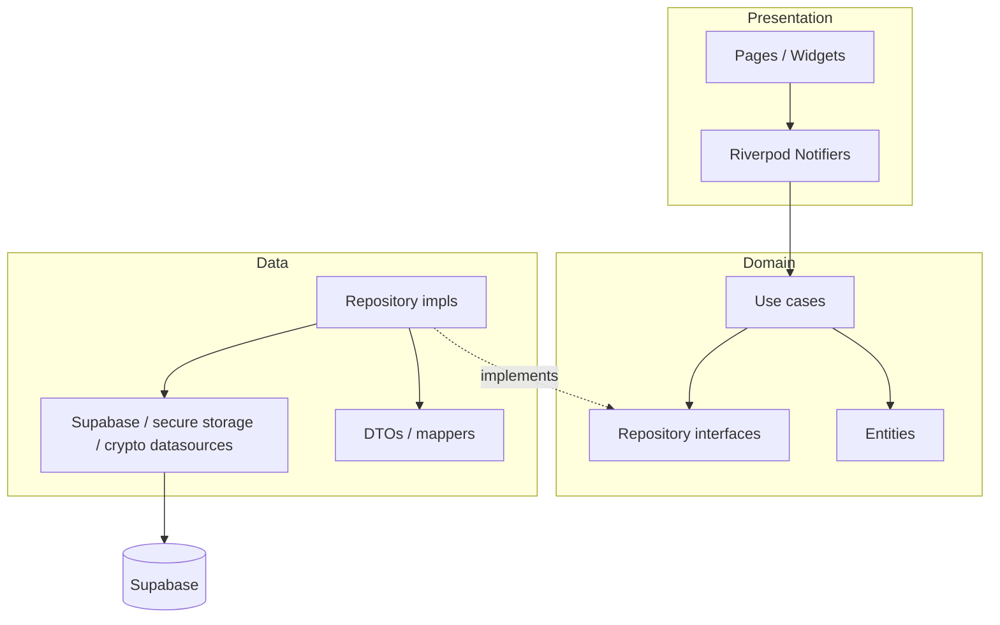
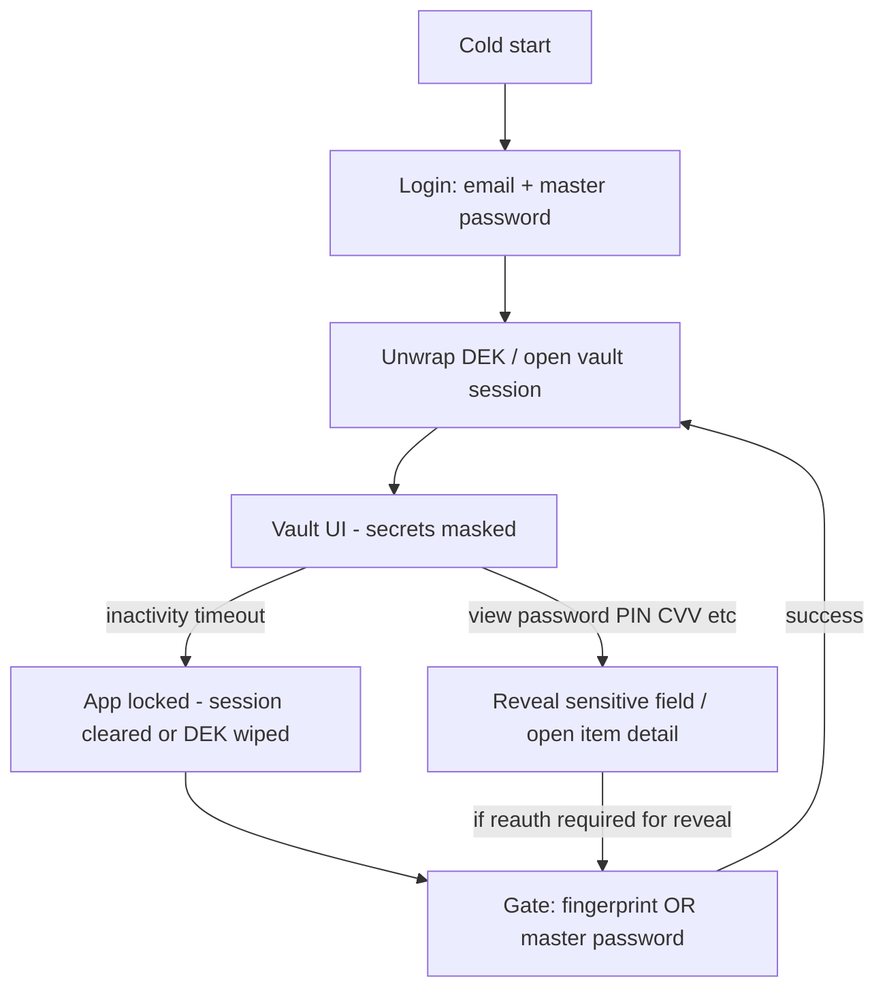
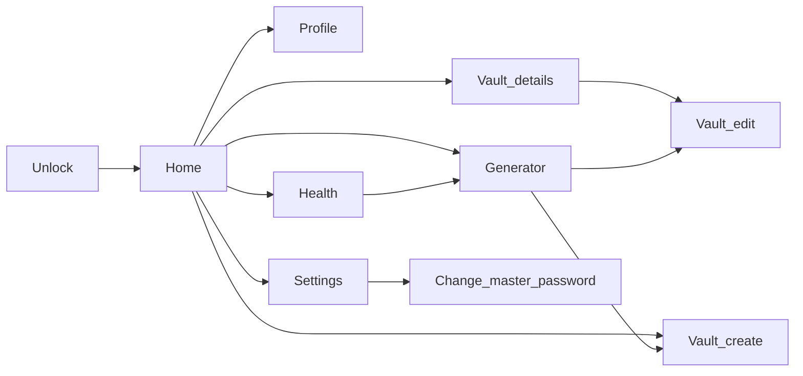
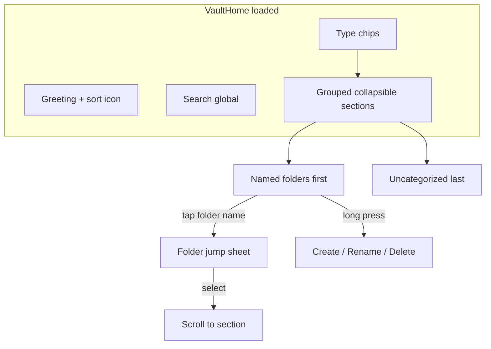
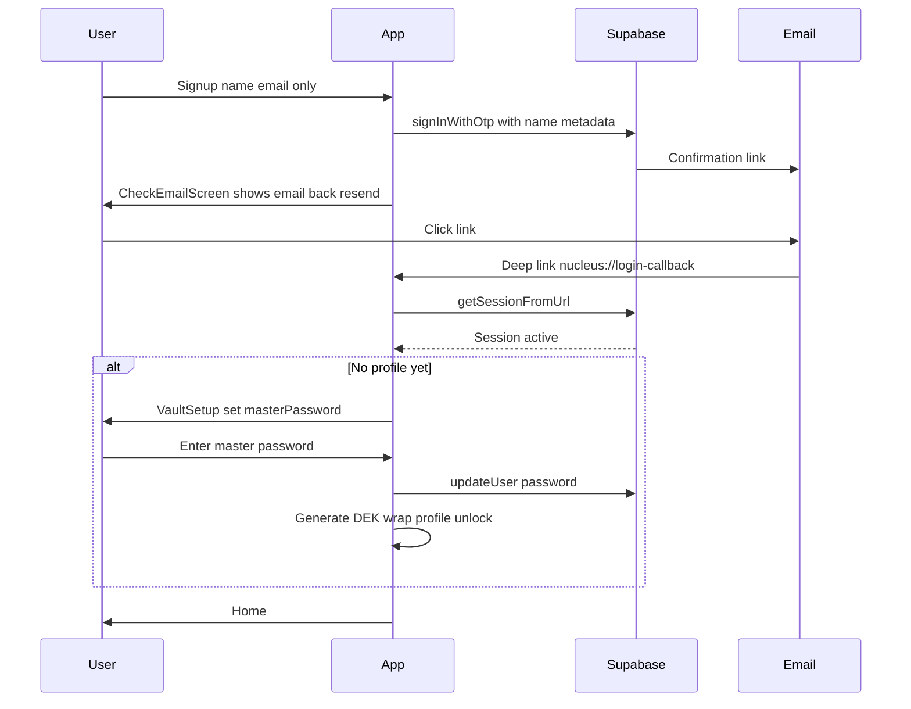
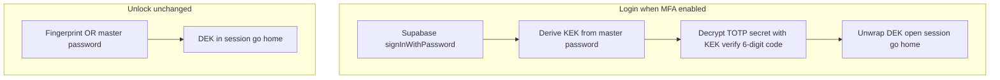
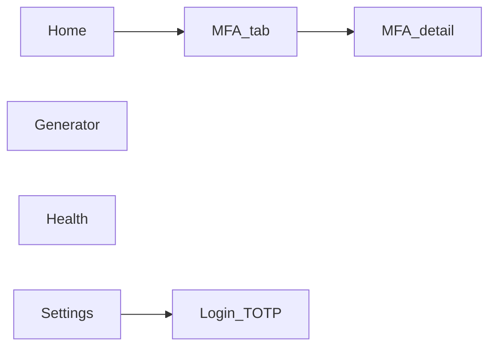

# Nucleus — Flutter + Supabase Password Manager

## Decisions locked

- **Frontend architecture:** Clean Architecture (feature-first folders; dependency rule inward)
- **State management:** Riverpod (`flutter_riverpod` + `riverpod_annotation` / codegen) in the presentation layer
- **Platform:** Android first (iOS later; keep code cross-platform-ready)
- **Supabase:** You create the project and apply SQL I provide; share **URL + anon key** only (never service role in the app)
- **Avatars:** 60 preset **PNG** assets you provide; custom gallery upload also supported
- **Loading:** Brand-matched Lottie at `assets/animations/loading.json` (created for Nucleus palette — not `ColorScheme.fromSeed`)
- **Re-auth gate:** Full login = email + master password (+ optional **login TOTP** when enabled — Phase 3); vault open / reveal secrets = master password **or** fingerprint (**no TOTP on unlock**)
- **Vault lock:** DEK cleared on auto-lock timeout (wall-clock since last activity, including background), manual **Lock vault now**, or logout — **not** on app pause or screen off. Returning to the app shows Unlock only if the timeout elapsed or the user locked manually.
- **Settings vs Profile:** Settings owns appearance, lock timers, re-auth grace, change master password, lock now, logout. Profile is a separate page from Home (avatar, name, read-only email). No profile link on Settings.
- **Navigation:** After unlock, Home is the root. Double-back on Home exits; any other page pops the stack.
- **Folders (Phase 1.5):** Single-level; plaintext names on server; items grouped on Home; Uncategorized last; no dedicated folders page.
- **Home UX (Phase 1.5):** Global search; sort within folder sections; full-page shimmer on initial load; health badges hidden when fine.
- **Auth onboarding (Phase 1.5):** Signup = name + email only (no password); `signInWithOtp` confirmation/magic link; profile/DEK only after verify + vault setup (user **sets** master password, which becomes Auth password). Same unconfirmed email just gets another OTP — no Edge Function. Confirmed users use login.
- **Google OAuth:** Deferred to Phase 2; same `/vault-setup` path for new OAuth users.
- **Login MFA (Phase 3):** Optional TOTP on **Login only** (email + master password + code when enabled). Secret is **KEK-wrapped** (same Argon2 KEK as DEK wrap — no new key system). **Unlock unchanged:** fingerprint or master password only; no TOTP on `/unlock`.
- **Vault sync (Phase 3, revised):** Default on `profiles`; per-item `sync_mode` set at create from default. **Form:** “Sync to Cloud” updates **draft state** until **Save** (new + edit). **Settings default change:** optional bulk upload/delete via **Confirm**; declining bulk updates default only and leaves existing items’ storage/sync as-is. Destructive actions are never silent.
- **Attachments (Phase 3):** Client-encrypted files on Supabase Storage (existing DEK); shared attachment model for all item types + standalone **Document** type; metadata (name, size, MIME) encrypted.
- **Site authenticator (Phase 3):** `mfa_entries` always cloud-synced; one entry can link to a vault item (e.g. password) and appear in both MFA tab and item detail.
- **Bottom nav (Phase 3):** Home · MFA · Generator · Health · Settings (five tabs).

## Color system (final — hand-authored, not fromSeed)

Direction: **Rose vault** — cool neutral canvases, sharp rose-red actions, calm surfaces. Primary brand `#F21649`. No purple gradients, no cream/terracotta, no neon glow.

### Light


| Token           | Hex         | Use                                           |
| --------------- | ----------- | --------------------------------------------- |
| `primary`       | `#F21649`   | CTA, active nav, FAB, focus                   |
| `primaryHover`  | `#D4143F`   | Pressed primary                               |
| `primarySoft`   | `#FFE5EC`   | Chips, selected rows, soft fills              |
| `onPrimary`     | `#FFFFFF`   | Text/icons on primary                         |
| `bg`            | `#F7F8FA`   | Scaffold                                      |
| `surface`       | `#FFFFFF`   | Sheets, fields, lists                         |
| `surfaceMuted`  | `#EEF0F3`   | Input fill / dividers soft                    |
| `border`        | `#E2E5EB`   | Hairlines                                     |
| `textPrimary`   | `#14151A`   | Titles, body                                  |
| `textSecondary` | `#6B7280`   | Hints, meta                                   |
| `textTertiary`  | `#9CA3AF`   | Masked dots, placeholders                     |
| `success`       | `#0D9F6E`   | Health strong                                 |
| `warning`       | `#D97706`   | Health weak                                   |
| `danger`        | `#E11D48`   | Destructive (close to brand, distinct enough) |
| `overlay`       | `#14151A99` | Unlock scrim                                  |


### Dark


| Token           | Hex         | Use                                  |
| --------------- | ----------- | ------------------------------------ |
| `primary`       | `#FF4D73`   | Slightly lifted for contrast on dark |
| `primaryHover`  | `#F21649`   | Pressed                              |
| `primarySoft`   | `#3D1524`   | Soft brand container                 |
| `onPrimary`     | `#FFFFFF`   |                                      |
| `bg`            | `#0F1014`   | Scaffold                             |
| `surface`       | `#1A1B22`   | Lists, sheets                        |
| `surfaceMuted`  | `#24262F`   | Inputs                               |
| `border`        | `#2E303A`   |                                      |
| `textPrimary`   | `#F4F4F5`   |                                      |
| `textSecondary` | `#A1A1AA`   |                                      |
| `textTertiary`  | `#71717A`   |                                      |
| `success`       | `#34D399`   |                                      |
| `warning`       | `#FBBF24`   |                                      |
| `danger`        | `#FB7185`   |                                      |
| `overlay`       | `#000000B3` |                                      |


Theme is built with explicit `ColorScheme` + custom `AppColors` extension (and text/button themes). **Do not use `ColorScheme.fromSeed`.**

### Sample UI (design preview)

Previews generated for plan review (see chat / `assets/` previews):

- Login (light) — brand wordmark, email + master password, primary Unlock
- Vault home (dark) — list + bottom nav + rose FAB
- Unlock sheet — fingerprint **or** master password when re-opening app / revealing secrets

### Loading Lottie

At bootstrap, ship `assets/animations/loading.json`: a minimal **concentric pulse / soft vault ring** using `#F21649`, `#FF4D73`, and `#FFE5EC` (light-friendly; still reads on dark surfaces). Shared `VaultLoader` widget; no spinner defaults.

## Architecture overview




**Clean Architecture rules (enforced in structure):**

- **Domain** has zero Flutter/Supabase imports — entities, repository contracts, use cases only
- **Data** implements domain repositories; maps DTOs ↔ entities; owns Supabase, secure storage, crypto adapters
- **Presentation** owns UI + Riverpod notifiers/controllers; calls use cases only (not datasources)
- **Core / shared** — theme, responsive `Scale`, errors, DI wiring, routing shell; no feature business rules

**Feature slice (example `vault`):**

```
features/vault/
  domain/     entities, vault_repository.dart, use_cases/
  data/       vault_remote_datasource, vault_repository_impl, mappers
  presentation/  pages, widgets, providers
```

Same pattern for `auth`, `unlock`, `profile`, `generator`, `health`, `settings`, `attachments`, `mfa` (Phase 3).

**Password health computation (shared across Vault home + Health tab):**

- Health scoring (weak / reused / old / fine) runs as part of the **same in-session decrypt pass** that feeds the Vault home list — no extra decrypt pass or Supabase round trip.
- Logic lives in `features/health/domain/` as a reusable use case (e.g. `EvaluatePasswordHealth` / batch evaluator over decrypted password items). **Presentation** in both `vault` and `health` calls this use case; no duplicated heuristics in either feature.
- A shared Riverpod provider/notifier (owned by `health` presentation, consumed by `vault` presentation) holds computed health state per item for the current session; both Vault home and Health tab read from the same source.

## Project bootstrap

- Create Flutter app in repo root (`nucleus` / `passmngr`)
- Android min SDK suitable for biometrics + secure flags
- Env via `--dart-define` or `flutter_dotenv` (`.env` gitignored; `.env.example` committed)
- Packages (core): `flutter_riverpod`, `riverpod_annotation`, `go_router`, `supabase_flutter`, `flutter_secure_storage`, `local_auth`, `cryptography` (or PointyCastle), `flutter_svg`, `lottie`, `image_picker`, `freezed` + `json_serializable`, screenshot restriction package (`screen_protector` / equivalent for `FLAG_SECURE`)
- Phase 1.5 adds: `app_links` (deep link handling; may already be transitive via `supabase_flutter`)
- Phase 3 adds: `drift` (+ codegen), `otp` (TOTP), `mobile_scanner` or equivalent (QR), `file_picker` (attachments)
- Shared loading widget wraps the provided Lottie JSON; used for auth, vault fetch, profile save, etc. Home initial load uses `VaultHomeSkeleton` shimmer instead.

## Zero-knowledge encryption (v1)

Your approach is sound and supports master-password change. Concrete crypto (simple, strong, not over-engineered):


| Piece        | Choice                                                                                     |
| ------------ | ------------------------------------------------------------------------------------------ |
| KDF          | Argon2id (via `cryptography`) — master password + per-user salt → KEK                      |
| DEK          | 32-byte random key generated at vault setup (Phase 1.5) or signup (Phase 1)                |
| Wrap         | Encrypt DEK with KEK (AES-256-GCM); store `encrypted_dek` + `salt` + KDF params on profile |
| Vault fields | AES-256-GCM with DEK; store ciphertext + nonce (and optional AAD = item id/type)           |
| In-memory    | DEK held only in a Riverpod session notifier after unlock; cleared on lock/logout          |
| Auth         | Master password set at vault setup (Phase 1.5); same string used for Supabase Auth password via `updateUser` |


**Signup flow (Phase 1 — superseded by Phase 1.5):** Auth signup → generate salt + DEK → wrap DEK → insert `profiles` row → unlock session.

**Signup flow (Phase 1.5 — current):** Signup form collects **name + email only** (no password) → `signInWithOtp` (magic link / email confirmation) with `name` in user metadata → **Check email** screen → user clicks confirmation link (deep link) → session established → **Vault setup** (user **sets** master password for the first time) → `updateUser(password)` + generate DEK → wrap → insert `profiles` row → unlock session. No profile/DEK until email verified. Master password is never collected at signup.

**Login flow:** Auth sign-in → load profile wrap → derive KEK → if login TOTP enabled, verify code (decrypt secret with KEK) → unwrap DEK → session ready. **Unlock flow (unchanged):** fingerprint or master password → DEK in session; no TOTP.  
**Master password change (implemented in Settings):** unwrap DEK with old password → re-wrap with new → update Auth password + profile wrap in one coordinated flow. UI: `/settings/change-master-password`. Re-wrap or re-encrypt login TOTP secret with new KEK in the same flow when login MFA is enabled.

Server stores only ciphertext for vault payloads; RLS ensures users only touch their rows.

## Supabase schema (you apply)

I will deliver SQL under `supabase/migrations/` covering:

`**profiles**`

- `id` UUID PK → `auth.users.id`
- `name` text
- `email` text
- `avatar_type` enum/`text` (`preset` | `custom`)
- `avatar_preset_id` text nullable
- `avatar_path` text nullable (Storage path)
- `theme_preference` text (`system` | `light` | `dark`)
- `encrypted_dek` text/bytea
- `kek_salt` text/bytea
- `kdf_params` jsonb (memory/iterations/parallelism for Argon2)
- `default_sync_mode` text (`cloud` | `local`) default `cloud` — **Phase 3**
- `login_totp_enabled` boolean default false — **Phase 3**
- `encrypted_login_totp_secret` text nullable — **Phase 3** (KEK-wrapped)
- `login_totp_secret_nonce` text nullable — **Phase 3**
- `created_at` / `updated_at` timestamptz

`**vault_items**` (single polymorphic table — easier ZK + future types)

- `id` UUID PK
- `user_id` UUID FK → profiles
- `item_type` text/enum: `password` | `bank_account` | `atm_card` | `note` | `document` ( **`document`** — Phase 3)
- `folder_id` UUID nullable FK → `vault_folders` (null = Uncategorized) — **Phase 1.5**
- `sync_mode` text (`cloud` | `local`) default `cloud` — **Phase 3** (meaningful for rows in cloud; local-only items live in Drift until uploaded)
- `encrypted_payload` text (AES-GCM ciphertext of JSON fields below)
- `nonce` text
- `created_at` / `updated_at` timestamptz  
- Optional non-sensitive index aids only if needed later; v1 encrypts **all** fields including label (list decrypts client-side after unlock)

`**vault_folders**` — **Phase 1.5**

- `id` UUID PK
- `user_id` UUID FK → profiles
- `name` text (plaintext organizational metadata — not encrypted)
- `sort_order` int (default 0; for manual folder ordering)
- `created_at` / `updated_at` timestamptz
- RLS: `auth.uid() = user_id`
- No nested folders in v1 (single-level only)

**Payload field contracts (JSON before encrypt):**

- **password:** `label`*, `url`, `username`*, `password*`, `notes`, `password_changed_at` (ISO-8601 timestamp; set on create; updated **only** when `password` changes — not on label/username/notes edits)
- **bank_account:** `label`*, `bank_name`*, `account_type*`, `account_no*`, `ifsc*`, `micr`, `notes`
- **atm_card:** `label`*, `bank_name`*, `name_on_card*`, `card_type*` (credit/debit), `card_no*`, `cvv*`, `expiry_date*`, `atm_pin`, `upi_pin`, `notes`
- **note:** `label`*, `notes`*
- **document (Phase 3):** `label`*, `notes`, optional `attachment_ids`

`password_changed_at` lives inside the encrypted JSON payload (not a `vault_items` column). Vault create/update mappers set it to `now` on first password set and bump it only when the decrypted `password` value differs from the previous value.

**`vault_attachments`** — **Phase 3** (see Phase 3 feature section for columns).

**`mfa_entries`** — **Phase 3** (site authenticator; always cloud-synced).

**Storage:** private bucket `avatars` — path `{user_id}/...`; RLS: owner read/write. Private bucket **`vault-files`** — encrypted attachment chunks; opaque paths — **Phase 3**.  
**RLS:** all tables `auth.uid() = user_id` / `id`.  
**Triggers:** `updated_at` auto-update.

You will: create project → run migration SQL → create publishable key → put URL/publishable key in `.env`.

## App features — Phase 1 (completed)

### Auth & unlock (session model)




- **Signup (Phase 1.5):** name + email only → check email → deep link → vault setup (**set** master password) → DEK/profile. **Login (returning):** email + master password unchanged.
- **Later app opens** (Supabase session may still be valid): do **not** ask for email again; show **Unlock** screen — **fingerprint or master password** only
- **Opening a vault item / viewing masked secrets** (password, PIN, CVV, account numbers, etc.): values stay masked until user passes **fingerprint or master password** (biometric preferred if enrolled; password always available fallback)
- **Auto-lock** (Settings, device-local prefs): lock after wall-clock inactivity — 30 seconds, 1 minute, 5 minutes, 15 minutes, 30 minutes, or **While using app** (no automatic lock until **Lock vault now** or logout). Background and screen-off do **not** lock immediately; inactivity includes time in background; on **resume**, the app re-checks the timer (OS may throttle timers while paused). **Lock vault now** on Settings wipes the in-memory DEK and shows Unlock.
- **Re-auth for secrets** (Settings, device-local prefs): Every time, 30 seconds, 1 minute, 2 minutes, 5 minutes — how long reveal/copy may skip fingerprint or master password after a successful gate.
- Device stores biometric-protected unlock material in `flutter_secure_storage` after first successful master-password unlock; never store master password in plaintext

### Profile (separate from Settings)

Pushed from **Home only** (`/profile`). Back pops to Home. Not linked from Settings.

- **Avatar:** show selected preset or custom photo; **Choose avatar** (60 PNGs in `assets/avatars/`, ids `1`…`60`) or **Upload photo** (gallery → Storage `avatars` bucket)
- **Name:** editable; save to `profiles.name`
- **Email:** from auth; **non-editable**
- Loading states use brand Lottie `assets/animations/loading.json`
- Do **not** put theme, auto-lock, change master password, lock, or logout here

### Settings

Bottom-nav tab. No profile name/avatar/email. Options:

- **Appearance:** System, Light, Dark — apply `ThemeMode` immediately; persist to `profiles.theme_preference`
- **Auto-lock vault:** 30 seconds, 1 minute, 5 minutes, 15 minutes, 30 minutes, While using app
- **Re-auth for secrets:** Every time, 30 seconds, 1 minute, 2 minutes, 5 minutes
- **Password age threshold:** 90 days or 180 days (device-local `SharedPreferences`, same pattern as auto-lock / re-auth grace). Default **90**. Used by Health **Old** filter (`password_changed_at` older than threshold).
- **Change master password:** implemented (unwrap/re-wrap DEK + Auth password update)
- **Lock vault now:** instant lock → Unlock screen (not login)
- **Log out:** confirm → clear session → login

Auto-lock and re-auth timers are local (`SharedPreferences`). Theme syncs to Supabase profile.

### Vault

- List / search (client-side after decrypt) / filter by type
- CRUD for all four item types
- Sensitive fields **always masked by default**; reveal requires fingerprint or master password per gate rules above
- Timestamps shown in device timezone (`DateTime` local conversion from UTC)
- **Health badges on home list (Phase 1.5 update):** show badge only when `primaryFlag != fine` — i.e. weak/fair, reused, or old. Hide badge for fully healthy (strong + not reused + not old) passwords. Health tab unchanged.

### Password generator

- Length, lower/upper/digits/symbols toggles
- Copy to clipboard; “Save as vault item” → password form prefilled (`generator -> vault item form`)
- After a successful save, **replace** the stack with `home -> vault item details` (not leave generator under the form)

### Password health

- **Role:** dedicated **triage/fix view** — not the only place strength/reuse/age is visible. Vault home provides at-a-glance badges; Health tab is for filtering, sorting, grouping, and fixing issues.
- **Shared health state:** strength/reuse/age scoring happens once per session during the vault list decrypt pass; Health tab and Vault home both consume the same Riverpod provider (see architecture note). Pure presentation-layer wiring — no duplicate health-check logic.
- Strength rules (length, charset variety, common-password check against a small local denylist); reuse detection among decrypted passwords in session
- Per-item health badge on password-type vault items (vault home list and detail)
- **List item identification:** each Health row displays `{label} — {identifier}` (e.g. `Netflix — john@mail.com`). Identifier = `username` if non-empty; else URL host from `url`. If label + identifier still collide, append a disambiguator (e.g. last-updated date from `updated_at`).
- **Fix now:** weak and reused items show a **Fix now** action on the row (and/or in item detail). Tap opens **Generator** pre-filled, then **vault item form in edit mode** for the **same existing item** (reuse `generator -> vault item form` pattern via `/vault/edit/:id` with existing item + generated password — not `/vault/new`). On save, **update** the existing item (not create); navigation stack replaces to `home -> vault item details` (same replace behavior as generator save).
- **Filter:** segmented control at top — **All / Weak / Reused / Old**. **Old** = `password_changed_at` older than Settings password-age threshold (default 90 days).
- **Stat shortcuts:** replace static Checked/Weak/Reused tiles with **tappable** shortcuts that apply the corresponding filter to the list below (e.g. tap **Weak** applies Weak filter).
- **Reused grouping:** when showing reused items (Reused filter or reused rows under All), cluster items sharing the same password under a **Reused password** group header instead of a flat list.

### Hardening / UX polish

- App-wide screenshot restriction (Android `FLAG_SECURE`)
- Explicit **Rose vault** palette from Color system section (no `fromSeed`)
- Responsive: single `Scale` helper (base width e.g. 390) applied to spacing, type, radii — no raw magic numbers in widgets
- Modern SVG icon set (`flutter_svg` + `assets/icons/`); no Material default icons as primary UI icons
- Minimal, convenience-first UI: clear vault home, FAB/add sheet by type, detail with masked secrets

### Navigation (`go_router`)

Auth-session present but vault locked → **unlock** route, not login.

After login/unlock, **Home is the root** of the app (`/home` in the bottom-nav shell: Home, Generator, Health, Settings). Overlay routes sit above the shell (bottom bar hidden): `/profile`, `/vault/:id`, `/vault/new`, `/vault/edit/:id`, `/settings/change-master-password`. Prefer `push`/`pop` over `go` for in-app flows.

**Android / system back:**

- On **Home** (no overlay): first back → “Press back again to exit”; second back within ~2s exits the app
- On **Generator / Health / Settings** with nothing pushed: back returns to **Home** (does not exit)
- On any **pushed** page: back **pops** to the previous page in the stack

**Page stacks** follow navigations from widgets on that page:




- `home -> profile`
- `home -> vault item details -> vault item edit`
- `home -> vault item create`
- `home -> generator -> vault item form` (new item); after save, stack becomes `home -> vault item details`
- `home -> health -> generator (fix flow) -> vault item edit/form`; after save, stack becomes `home -> vault item details` (same replace behavior as generator save)
- `home -> settings -> change master password`

Lock vault / logout use `go` to `/unlock` or `/login` and clear the vault stack. Edit save pops back to details (`home -> details`).

## App features — Phase 1.5 (completed)

Phase 1.5 extends vault organization, Home UX, and auth onboarding. All new UI reuses existing Rose vault components (`Scale`, `AppColors`, `AppIcon`, bottom sheets, list rows) — no separate UI pass.

### Vault folders

**Data model:** `vault_folders` table + nullable `folder_id` on `vault_items`. Folder names are plaintext (organizational metadata). Single-level folders only (no nesting).

**Folder management (no dedicated folders page):**

| Action | Trigger | UI |
|--------|---------|-----|
| Create folder | Long-press any folder section header (including Uncategorized) | Bottom sheet → **Create folder** → name dialog |
| Rename folder | Long-press a **named** folder header | Bottom sheet → **Rename** → pre-filled name dialog |
| Delete folder | Long-press a **named** folder header | Bottom sheet → **Delete** → confirm → items move to **Uncategorized** |
| Assign folder | Create/edit vault item | Folder picker (default **Uncategorized**); **+ New folder** inline in picker |
| Jump to folder | Tap folder name in section header | Bottom sheet lists folders in current type context → scroll to section only |

- **Uncategorized** header long-press: **Create folder** only (no rename/delete).
- New items default to **Uncategorized** unless user picks a folder on create/edit.
- Delete folder never deletes items.

**Feature slice:** extend `features/vault/` (or add `features/folders/` if cleaner) — domain entity `VaultFolder`, repository methods, Riverpod provider synced with vault list.

### Home — grouping, search, sort, jump

**Grouped list:**
- Items displayed under **collapsible folder section headers** (all **expanded by default** on first load).
- Section order: named folders first (by `sort_order` then name), **Uncategorized last**.
- Type chips (All / Password / Bank / Card / Note) filter items; within active filter, grouping by folder remains.
- Empty folder sections hidden while searching.

**Search:** always **global** across all folders (not folder-scoped). Matching items appear under their folder headers.

**Sort** (icon in Home header → bottom sheet; persisted in `SharedPreferences`):
- Name A → Z / Z → A
- Recently updated (newest first) — default
- Oldest updated
- Recently created / Oldest created
- No "Type" sort (type chips cover that)
- Sort applies **within each folder section**.

**Folder jump sheet:** tap folder name in header → bottom sheet → select folder → **scroll to section** only. Other sections keep their collapsed/expanded state (no collapse of other folders).



### Home — skeleton loading

**Problem:** partial skeleton (list only) while search/chips/sort are interactive causes race conditions during load.

**Solution:** on **initial load** (`vaultListProvider.loading && no cached items`), replace the **entire Home content** with animated shimmer placeholders mirroring the real layout:
- Greeting row (avatar + text bars)
- Search bar
- Type chip pills
- Sort affordance
- Folder section headers + item rows

- Shimmer uses `surfaceMuted` / `surface` sweep (Rose palette) — `VaultHomeSkeleton` in `shared/widgets/`.
- **No real interactions** during skeleton state.
- **Pull-to-refresh:** keep existing items + `RefreshIndicator` — no skeleton.
- **Splash, login, unlock, other tabs:** keep existing `VaultLoader` — no skeleton.

### Home — health badges (update)

- Show `HealthBadge` on password rows only when `healthSnapshot.primaryFlag != ItemHealthFlag.fine`.
- Show for: weak/fair, reused, old. Hide for fully healthy passwords.
- Gating at call site in `vault_home_page.dart`; Health tab unchanged.

### Auth — email verification + deep linking

**Replaces Phase 1 signup workaround** (auto-`signIn` when `currentUserId == null` after signup).



**Signup form:** name and email only — **no password field**. Name stored in Supabase user metadata (`options.data.name`) at OTP/magic-link request time.

**Auth API:** use `signInWithOtp` (creates user on first link click if not exists) with `emailRedirectTo` pointing to deep-link URI. Do **not** use `signUp` with a password at this stage.

**Check email screen (`/check-email`):**
- Shows the email address entered.
- **Back** returns to signup so user can change email.
- **Resend confirmation** button (re-invoke `signInWithOtp` or `auth.resend`).
- No vault access; no profile/DEK created yet.

**Deep link (Android v1):**
- Redirect URI: `nucleus://login-callback` (or project-specific scheme).
- Android `AndroidManifest.xml` intent filter (`VIEW` + scheme).
- Supabase dashboard: Site URL + Redirect URLs include the scheme.
- Handle in `main.dart` / router: `Supabase.instance.client.auth.getSessionFromUrl()` on incoming URI + `onAuthStateChange`.

**Vault setup screen (`/vault-setup`):**
- Router gate: `session exists && profile == null` → `/vault-setup` (not `/home`).
- User **sets master password** for the first time (create + confirm fields).
- On success:
  1. `updateUser(password: masterPassword)` — sets Supabase Auth password (same string as vault master password going forward).
  2. Generate DEK, wrap with KEK derived from master password, create `profiles` row (name from user metadata), cache DEK for biometrics, open unlocked session → `/home`.

**Login (returning verified users):** unchanged — email + master password → load profile → unwrap DEK → unlock.

**Same email again before confirm:** signup never stores a password, so a second attempt only calls `signInWithOtp` again (new confirmation link). No `re-register-unconfirmed` Edge Function. Confirmed accounts belong on login, not signup.

**Router gates (updated):**

```text
No session              → /login or /signup
Session, no profile     → /vault-setup (or /check-email if pending verify)
Session + profile, locked → /unlock
Session + profile, unlocked → /home
```

**Unified post-auth onboarding (future-proof for Google OAuth in Phase 2):** any auth provider that yields a session without a `profiles` row routes to `/vault-setup`.

### Navigation updates (Phase 1.5)

New routes: `/check-email`, `/vault-setup`.

Auth-session present, email verified, profile missing → `/vault-setup`, not `/home`.

Existing overlay routes unchanged. Lock/logout still `go` to `/unlock` or `/login`.

## App features — Phase 3 (build next)

Phase 3 adds encrypted document attachments, local/cloud sync, and MFA/TOTP. All new UI reuses Rose vault components (`Scale`, `AppColors`, `AppIcon`, card rows, bottom sheets, confirm dialogs) — minimal, modern, no default Flutter widget styling as primary chrome.

### Global constraints (Phase 3)

- **Zero-knowledge:** Supabase DB and Storage see only ciphertext and opaque paths. Encrypt attachment bytes, chunk manifests, filenames, sizes, MIME types, vault/MFA payloads with the **DEK** (AAD = stable ids, e.g. `id:itemType`, `attachment_id:chunk_index`). Login TOTP secret uses **KEK** (master password + salt) — not a second key system.
- **DEK architecture unchanged:** one DEK per user at profile creation; all vault items and site MFA entries use it. No new per-feature keys.
- **Destructive / sync switches:** always explain impact in a dialog and require explicit confirmation — never silent defaults.
- **Future scope (note only):** encrypted export/import of local-only vault data using the same DEK (not designed in Phase 3). Local-only items have **no cloud backup** if the device is lost.

### Flow impact summary

| Area | Before Phase 3 | Phase 3 change |
|------|----------------|----------------|
| Vault data | Cloud-only `VaultRepository`; offline errors | Composite cloud + **Drift** local DB; merge lists by `sync_mode` |
| Login | Email + master password → unwrap DEK | If login MFA on: + **TOTP step after password**, before DEK in session |
| Unlock | Fingerprint **or** master password | **Unchanged** — no TOTP on unlock |
| Bottom nav | Home, Generator, Health, Settings | **Home · MFA · Generator · Health · Settings** |
| Settings Security | Auto-lock first | **Login two-factor (TOTP)** first, then auto-lock, etc. |
| Item types | Four types | Fifth type **`document`**; multi-file attachments on any type |
| Attachments | N/A | `vault_attachments` + `vault-files` bucket; chunk if plaintext **> 5 MB** |



### Document storage and attachments

**New item type:** `vault_items.item_type` adds `document`.

**Encrypted payload JSON (before AES-GCM):**

- **document:** `label*`, `notes`, optional `attachment_ids` (UUID ordering; canonical list also via FK)
- **All types:** optional `attachment_ids` when files attached; bytes never in JSON

**Table `vault_attachments`:**

| Column | Purpose |
|--------|---------|
| `id` uuid PK | Client-generated; used in crypto AAD |
| `user_id` uuid FK | RLS `auth.uid() = user_id` |
| `vault_item_id` uuid FK → `vault_items` ON DELETE CASCADE | Parent item (any type including `document`) |
| `storage_root` text | Opaque prefix `{user_id}/{attachment_id}/` — no plaintext filename in path |
| `encrypted_metadata` text | AES-GCM(JSON): `original_filename`, `mime_type`, `size_bytes`, `chunk_count`, `chunk_size`, optional `content_hash` |
| `metadata_nonce` text | |
| `created_at` / `updated_at` | |

**Storage:** private bucket `vault-files`; objects `{user_id}/{attachment_id}/{chunk_index}`; RLS owner-only (mirror `avatars`).

**Chunking:** plaintext **≤ 5 MB** → single chunk `0`; **> 5 MB** → split (~**4 MB** plaintext per chunk before encrypt); manifest only in `encrypted_metadata`. Each chunk: AES-256-GCM(DEK, chunk, AAD `attachment_id:chunk_index`).

**Feature slice:** `features/attachments/` (or under `vault/`) — `AttachmentRepository`, upload/download/delete/list use cases.

**UI / flows:**

| Flow | Behavior |
|------|----------|
| Add | File picker (multi) → encrypt (+ chunk) → upload with **linear progress** per file/chunk → insert row → save item with `attachment_ids` |
| View (detail) | Attachment cards (name/MIME/size after decrypt); preview PDF/image in-app where feasible; else temp decrypt + open |
| Download | Decrypt with progress; cancel/retry |
| Delete | Confirm → delete Storage objects + DB row → update payload |
| Failures | Orphan partial uploads cleaned on retry/discard; offline uses existing connectivity messaging |

**Shared widget:** `AttachmentsSection` on vault item **form** and **detail**. Document create: folder picker + label + notes + **at least one file**. Home: **Document** type chip + FAB sheet entry. Folder grouping unchanged.

**Migration:** `003_attachments.sql` — bucket, `vault_attachments`, extend `item_type` check.

### Local / cloud sync

**Default:** cloud-first; no local cache until user opts in.

**Schema:**

- `profiles.default_sync_mode` — `cloud` \| `local`, default **`cloud`** (stored in cloud; applies on all devices for **new** items)
- `vault_items.sync_mode` — `cloud` \| `local`, default **`cloud`** (set from profile default at item **creation**; editable on **edit** screen only)

**Local-only items:** Drift on device; no `vault_items` row until user uploads. Same encrypted payload shape and client UUIDs for promotion to cloud.

**Repository:** facade over `CloudVaultDataSource` (current Supabase) + `LocalVaultDataSource` (Drift); `listItems` merges by id. **Attachments** follow parent item sync. **Exception:** `mfa_entries` always cloud (see MFA).

**Settings — Sync section:** **Default for new items** (Cloud / Local). Step A: confirm default change (existing items untouched unless user opts into bulk). Step B: optional bulk — **local → cloud default:** upload all Drift-only items (skip ids already in cloud); **cloud → local default:** delete all user vault rows from cloud (`moveCloudToLocal` with delete). Declining bulk updates `default_sync_mode` only.

**Per-item (form):** Sync switch on create/edit; default from profile at create. Toggling updates **draft** only; **Save** runs `createItem` / `updateItem` or `moveLocalToCloud` / `moveCloudToLocal(deleteFromCloud: true)` when draft ≠ saved. No toggle-time dialogs; edit cloud → local always removes cloud copy on Save.

**Multi-device:** Profile default syncs via `profiles`; bulk delete is global; per-item `sync_mode` on cloud rows updates for all devices when changed via Save.

**Future:** encrypted export/import for local-only data (DEK only) — paragraph in Settings/Sync copy; not implemented in Phase 3.

**Migration:** `004_sync.sql`.

### MFA / TOTP

Two parts: **(A) Nucleus login** and **(B) built-in authenticator for other sites**.

#### A) Login two-factor (Settings)

- **Profile columns:** `login_totp_enabled` (boolean metadata); `encrypted_login_totp_secret` + `login_totp_secret_nonce` (AES-GCM with **KEK**).
- **Settings UI:** first option under **Security** — **Login two-factor (TOTP)** → setup/disable overlay (`/settings/login-mfa-setup`).
- **Setup (vault unlocked):** confirm master password → QR + manual secret → verify 6-digit code → persist KEK-wrapped secret.
- **Disable:** confirm + master password → clear fields.
- **Login only:** after `signInWithPassword`, derive KEK → if enabled, **TOTP screen** (DEK not in session yet) → on success unwrap DEK → `/home`. **Unlock (`/unlock`): unchanged** — fingerprint or master password; **no TOTP**.
- **Master password change:** re-wrap login TOTP secret with new KEK when MFA enabled.
- **Library:** maintained TOTP package (e.g. `otp`) — no custom RFC 6238 implementation.

#### B) Site authenticator (MFA tab)

**Table `mfa_entries`** (always cloud — ignores vault `sync_mode`):

| Column | Purpose |
|--------|---------|
| `id`, `user_id` | RLS |
| `encrypted_payload`, `nonce` | DEK JSON: `secret`, `issuer`, `account_name`, `algorithm`, `digits`, `period` |
| `vault_item_id` uuid nullable FK → `vault_items` | Link to password (or other) item — **single source of link** (no duplicate id in item payload) |
| `sort_order` or sort key | Issuer / account sorting |
| timestamps | |

- **Password item:** add TOTP while editing → create `mfa_entries` with `vault_item_id` → **detail** shows MFA card (live code or link to MFA detail) + entry in **MFA tab** (one row, not duplicated).
- **MFA tab:** standalone add via QR scan (`/mfa/scan`) or manual (`/mfa/new`); full CRUD; sort sheet (issuer A–Z, account A–Z, recently added); **no folders**.
- **Detail** (`/mfa/:id` overlay): large 6-digit code, countdown ring, copy; edit/delete.
- **Footnote in MFA tab / Settings:** authenticator entries always sync to cloud so codes survive device loss; **open to reconsider** local-only MFA for advanced users later.
- Code generation **client-side only**.

**Migration:** `005_mfa.sql`.

### Navigation updates (Phase 3)

Bottom-nav shell: **Home · MFA · Generator · Health · Settings** (`StatefulShellRoute` five branches). Back behavior unchanged: non-Home tabs return Home first; double-back on Home exits.

**New shell route:** `/mfa` — list page (card rows matching vault home spacing).

**Overlays (bottom bar hidden):** `/mfa/new`, `/mfa/edit/:id`, `/mfa/scan`, `/settings/login-mfa-setup`; existing vault/profile/settings overlays unchanged.



**Login route:** optional step after password → `LoginTotpPage` before vault session opens.

### UI consistency (Phase 3)

- Section headers: `textSecondary`, `fontSm`, `fontWeight.w600` (Settings pattern).
- Lists: `surface` cards, `Scale` padding, `AppIcon` leading icons — MFA tab must not look bolted-on.
- Upload/download: rose **linear** progress indicators; full-screen loading uses `VaultLoader` / skeleton patterns where appropriate.
- Dialogs: title + plain-language body; destructive actions use `danger` token.

### Phase 3 implementation order

1. `004_sync.sql` + Drift schema + composite `VaultRepository` + Settings/per-item sync UI + confirm dialogs
2. `003_attachments.sql` + encrypt/upload/download + `AttachmentsSection` + `document` type + Home chip/FAB
3. `005_mfa.sql` + login MFA (Login flow only) + Settings Security row
4. MFA tab + `mfa_entries` CRUD + password-item linking + five-tab shell + routes
5. `ARCHITECTURE.md` + `CHANGELOG.md` when implemented

## Folder structure (target)

```
lib/
  main.dart
  app.dart
  router/
  core/                    # theme, scale, errors, screenshot, DI — no feature logic
  features/
    auth/
      domain/
      data/
      presentation/
    unlock/
      domain/
      data/
      presentation/
    vault/
      domain/
      data/
      presentation/
    folders/                # optional slice; may live under vault/
      domain/
      data/
      presentation/
    generator/
      domain/
      data/                 # if any persistence; else domain + presentation only
      presentation/
    health/
      domain/
      presentation/
    profile/
      domain/
      data/
      presentation/
    settings/
      domain/
      data/
      presentation/
    attachments/            # Phase 3 — encrypted files (may nest under vault/)
      domain/
      data/
      presentation/
    mfa/                    # Phase 3 — site authenticator + login MFA setup UI
      domain/
      data/
      presentation/
  shared/                  # cross-feature widgets (Lottie loader, masked field, VaultHomeSkeleton, AttachmentsSection, etc.)
assets/
  icons/                   # SVG UI icons
  avatars/                 # 60 preset PNGs (you supply)
  animations/              # loading.json — brand Lottie (shipped with app)
supabase/migrations/
  001_initial.sql
  002_folders.sql
  003_attachments.sql      # Phase 3
  004_sync.sql             # Phase 3
  005_mfa.sql              # Phase 3
.env.example
```

Crypto lives behind a domain port (e.g. `VaultCrypto` / `KeyWrapService`) with the implementation in `data` or `core/crypto` injected via Riverpod — presentation never touches raw keys beyond session state owned by an unlock use-case/notifier.

## Phase 2 — planned later (schema/app hooks only where cheap)


| Feature                | Keep in mind now                                                                                                          |
| ---------------------- | ------------------------------------------------------------------------------------------------------------------------- |
| **Google OAuth**       | "Continue with Google" on login/signup; new users route to same `/vault-setup` (create master password + DEK); no email verification for Google users; enable provider in Supabase dashboard |
| Share by email         | Future `shares` table + re-encryption to recipient DEK (needs public key or wrap ceremony)                                |
| Open site + auto-login | Android intents / custom tabs; never expose password in UI                                                                |
| OCR                    | Camera + ML kit pipeline into forms                                                                                       |
| Emergency access       | `emergency_contacts`, `access_requests`, wait period, owner deny — design like Dashlane; crypto needs trustee wrap of DEK |
| Hide-my-email          | External email relay provider later                                                                                       |
| Travel mode            | Temporary hide/exclude vault subsets                                                                                      |
| Duress unlock          | Secondary password → decoy vault or wipe flag (careful product/legal design)                                              |
| Nested folders         | `parent_id` on `vault_folders` if single-level becomes limiting                                                           |
| Local vault export/import | Encrypted backup of local-only items (same DEK); noted in Phase 3 Sync copy only                                       |


Phase 1 code stays modular so these plug in without rewriting crypto core.

## Supabase collaboration checklist

1. I write `supabase/migrations/001_initial.sql` (tables, enums, RLS, storage policies, triggers) — **done**
2. I write `supabase/migrations/002_folders.sql` (`vault_folders`, `folder_id` on `vault_items`, RLS) — **done**
3. I write `supabase/migrations/003_attachments.sql`, `004_sync.sql`, `005_mfa.sql` — **Phase 3**
4. You create Supabase project and run the SQL migrations
5. You enable **Email auth** with **email confirmation required**; configure redirect URL `nucleus://login-callback`
6. You create `avatars` bucket per migration notes; **`vault-files` bucket** per `003_attachments.sql`
7. You send **Project URL** + **publishable public key** for `.env`
8. Drop **60 preset avatar PNGs** into `assets/avatars/` when ready (placeholders until then). Loading Lottie is created to match the Rose vault palette during bootstrap.

## Implementation order

**Phase 1 (completed):**

1. Flutter project + Clean Architecture folders + deps + explicit theme tokens + scale/router + brand Lottie loader
2. Supabase migration SQL + env wiring
3. Domain ports + crypto/auth/unlock use cases (login vs unlock gates) + data impls + presentation
4. Profile (name, avatars) as a Home-pushed page; Settings (theme, auto-lock, re-auth, change master password, lock now, logout)
5. Vault CRUD + masked secrets + fingerprint/password reveal gate
6. Generator + health (filters/sort/group, Fix now flow, `password_changed_at`); generator/fix save replaces stack to `home -> details`
7. Home-rooted back stacks (double-back exit on Home)
8. Screenshot guard + Android polish
9. README: run instructions, schema apply steps, asset drop-in notes, security notes

**Phase 1.5 (completed):**

1. `002_folders.sql` migration + folder domain/data layer
2. Folder CRUD (long-press header sheet, item form picker) + `folder_id` on vault CRUD
3. Home grouped list (collapsible sections, type filter + folder grouping, global search)
4. Home sort (sheet + SharedPreferences persistence)
5. Folder jump sheet (scroll only)
6. Home health badge gating (hide fine)
7. `VaultHomeSkeleton` full-page shimmer on initial load
8. Email verification flow: check-email screen (resend, back), remove auto-signIn workaround
9. Deep link handler (Android intent filter + `getSessionFromUrl`)
10. `/vault-setup` screen (set master password + `updateUser` → DEK/profile creation)
11. Router gates for `profile == null`
12. Update `ARCHITECTURE.md` + `CHANGELOG.md`

**Phase 3 (next):** see **Phase 3 implementation order** under App features — Phase 3.

## Out of scope for Phase 1 / 1.5 / 3 (where noted)

- iOS shipping, web/desktop
- Google OAuth (Phase 2)
- Sharing, emergency access, OCR, travel/duress, hide-my-email
- Nested folders (Phase 2+)
- Full design of local vault export/import (Phase 3: future note only)
- Local-only MFA entries (Phase 3: cloud-only for site authenticator; may revisit)

