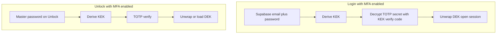
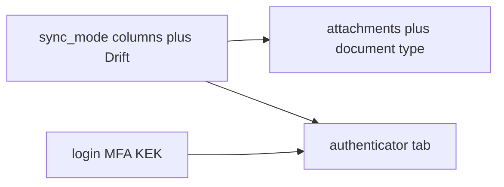

# Update Nucleus plan — Phase 3 features

## What to edit

Single file: [.cursor/plans/nucleus_flutter_app_fe530d03.plan.md](.cursor/plans/nucleus_flutter_app_fe530d03.plan.md).

- Add **Phase 3** section (after Phase 1.5, before or replacing overlapping rows in **Phase 2 — planned later**).
- Add YAML `todos` for Phase 3 workstreams (pending).
- Refresh **Decisions locked**, **Supabase schema**, **Navigation**, **Folder structure**, **Implementation order**, and **Out of scope** so they stay consistent.
- Do **not** change Phase 1.5 pending todos unless a dependency forces a one-line cross-reference (e.g. folders must ship before Document type uses `folder_id`).

---

## Established flows that change (flag prominently in plan)

| Area | Today (plan + [ARCHITECTURE.md](docs/ARCHITECTURE.md)) | Phase 3 impact |
|------|--------------------------------------------------------|----------------|
| **Vault data path** | All items live in Supabase; [VaultRepository](lib/features/vault/domain/repositories/vault_repository.dart) is cloud-only; offline = error | Composite repository: cloud + local DB; list/CRUD must merge by `sync_mode` and handle partial connectivity |
| **Unlock / login** | Login → unwrap DEK → `/home`; Unlock → biometric **or** password → `/home` ([unlock_page.dart](lib/features/unlock/presentation/pages/unlock_page.dart)) | Login MFA (KEK-wrapped TOTP) runs **after** Supabase password auth, **before** DEK enters session; when login MFA enabled, **disable biometric-only unlock** (biometrics cannot derive KEK for TOTP)—user uses master password + TOTP, then optional re-enable biometrics after successful gate (document explicitly) |
| **Bottom nav** | 4 tabs: Home, Generator, Health, Settings ([app_shell.dart](lib/shared/widgets/app_shell.dart)) | **5 tabs:** Home · **MFA** · Generator · Health · Settings; update `StatefulShellRoute` branches and back behavior (non-Home tabs still return Home first) |
| **Settings Security** | Auto-lock first under Security ([settings_page.dart](lib/features/settings/presentation/pages/settings_page.dart)) | New **first** row: **Login two-factor (TOTP)** → setup/disable flow |
| **Item types** | Four types; Home type chips | Fifth type **`document`**; chip + FAB add sheet entry |
| **Phase 2 table** | “Local / cloud / both” and “Secure documents” as vague hooks | Move detailed design into Phase 3; leave Phase 2 for OAuth, sharing, OCR, etc. |
| **ZK contract** | DEK for all vault payloads; folder names plaintext | Unchanged for vault/MFA entries/attachments; **login TOTP secret is KEK-wrapped** (same Argon2 KEK as DEK wrap—not a new key system); server may store `login_totp_enabled` boolean on profile (non-secret metadata) |

---

## Global constraints (repeat in Phase 3 header)

- Zero-knowledge: Supabase Storage and DB see only ciphertext/opaque paths; encrypt attachment bytes, chunk manifests, filenames, sizes, MIME types, and MFA payloads with **DEK** (AAD = stable ids as today `id:itemType`).
- **No new key systems:** one DEK per user; login MFA secret uses existing **KEK** (master password + salt), same crypto module as DEK wrap.
- UI: reuse `Scale`, `AppColors`, `AppIcon`, card rows, bottom sheets, confirm dialogs (Rose palette—not default Material chrome); destructive/sync switches always **explain + confirm**, never silent defaults.
- **Future only (one paragraph, no design):** encrypted local export/import of local-only vault data using existing DEK; warn local-only items have **no cloud backup** if device is lost.

---

## Feature 1 — Document storage and attachments

### Data model

**New item type** on `vault_items.item_type`: `document`.

**Encrypted payload JSON (before AES-GCM):**

- **document:** `label*`, `notes`, optional `attachment_ids` (array of UUID strings for ordering; canonical list also via FK)
- **All types (optional):** extend payloads with `attachment_ids` where attachments exist; attachment bytes never in JSON

**New table `vault_attachments`** (metadata row per file; blobs in Storage):

| Column | Purpose |
|--------|---------|
| `id` uuid PK | Client-generated; used in AAD |
| `user_id` uuid FK | RLS |
| `vault_item_id` uuid FK → `vault_items` ON DELETE CASCADE | Parent item (any type including `document`) |
| `storage_root` text | Opaque path prefix, e.g. `{user_id}/{attachment_id}/` — no plaintext filename |
| `encrypted_metadata` text | AES-GCM(JSON): `original_filename`, `mime_type`, `size_bytes`, `chunk_count`, `chunk_size`, `content_hash` (optional integrity) |
| `metadata_nonce` text | |
| `created_at` / `updated_at` | |

**Storage:** private bucket `vault-files`; objects `{user_id}/{attachment_id}/{chunk_index}`; RLS owner-only (mirror `avatars` pattern).

**Chunking:** if plaintext size **≤ 5 MB**, single object `chunk_0`; if **> 5 MB**, split into encrypted chunks (recommend **4 MB** plaintext per chunk before encrypt to stay under limits after overhead); manifest only inside `encrypted_metadata`.

**Crypto:** each chunk = AES-256-GCM(DEK, plaintext chunk, AAD `attachment_id:chunk_index`).

### App architecture

- New slice `features/attachments/` (or `vault/attachments/`) — domain port `AttachmentRepository`, use cases upload/download/delete/list.
- Presentation: shared **AttachmentsSection** widget on [vault_item_detail_page.dart](lib/features/vault/presentation/pages/vault_item_detail_page.dart) and [vault_item_form_page.dart](lib/features/vault/presentation/pages/vault_item_form_page.dart) (add/replace/remove); Document form is label + notes + folder picker + attachments (required at least one file on create—product rule in plan).
- Home: Document chip; list row icon/label like other types; folder grouping unchanged.

### User flows

1. **Add:** pick file(s) → client encrypt (+ chunk) → upload with progress per file/chunk → insert `vault_attachments` row → update item payload `attachment_ids` on save.
2. **View:** detail shows attachment cards (decrypted name/MIME/size only in UI after unlock); tap opens in-app preview where feasible (PDF/image) or “Open with…” via temp decrypted file cleared after use.
3. **Download:** decrypt to cache/temp with progress; handle cancel/retry.
4. **Delete:** confirm → remove Storage objects + DB row → update item payload.
5. **Failure handling:** failed chunk upload leaves orphan objects—plan **cleanup job on retry** (delete partial prefix) + user-visible “Upload failed—retry or discard”; download failures show retry; offline uses existing [connectivity](lib/core/network/connectivity_service.dart) messaging.

### Migration

- `003_attachments.sql`: bucket policies, `vault_attachments`, extend `item_type` check to include `document`.

---

## Feature 2 — Local / cloud sync

### Data model

**`profiles`** (cloud-only, plaintext enum):

- `default_sync_mode` text check (`cloud` | `local`) — default **`cloud`**

**`vault_items`** (for rows that exist in cloud):

- `sync_mode` text check (`cloud` | `local`) — default **`cloud`**; no “inherit” column (effective mode = item value; new items copy profile default at creation time)

**Local-only items:** stored in on-device DB (plan **Drift**—align with Phase 2 “local DB” note); **no** `vault_items` row until user uploads. Use same encrypted payload shape and IDs (UUID generated client-side) so promotion to cloud is possible.

### Repository pattern

- Refactor toward **`VaultRepository`** facade:
  - `CloudVaultDataSource` (current Supabase impl)
  - `LocalVaultDataSource` (Drift)
  - `listItems` merges by id; cloud wins on conflict only when both exist (shouldn’t happen if modes respected)
- **MFA entries and attachments** follow parent item sync for attachments; **exception:** MFA tab entries always cloud (see Feature 3).

### Settings UI

- New section **Sync** (after Security or within it): **Default for new items** — Cloud / Local (writes `profiles.default_sync_mode`).
- Short explainer: default is stored in cloud and applies on all devices for **new** items; existing items keep their per-item mode until changed.

### Per-item UI

- Create/edit: **Sync to Cloud** switch updates **draft** until **Save**. New items: `createItem` with draft mode. Edit: if draft ≠ saved, **Save** runs `moveLocalToCloud` or `moveCloudToLocal(deleteFromCloud: true)` then field update. Cloud → local on Save always deletes cloud copy (no “leave in cloud”).

### Settings default + optional bulk

**Step A:** Confirm default change (existing items unchanged unless bulk opted in).

**Step B:** **local → cloud:** offer upload all local-only items (skip ids already in cloud). **cloud → local:** offer delete all vault items from cloud (local copies retained). Decline = update `default_sync_mode` only.

**Multi-device note:** profile default syncs via cloud; bulk delete is global; per-item `sync_mode` on cloud rows visible to all devices when updated via Save.

### Future scope (paragraph only)

- Encrypted export/import for local-only data (DEK, no new keys); not implemented in Phase 3.

### Migration

- `004_sync.sql`: profile + vault_items columns.

---

## Feature 3 — MFA / TOTP

### A) Nucleus login MFA (Settings)

- **Storage on `profiles`:** `login_totp_enabled` boolean; `encrypted_login_totp_secret` + `login_totp_secret_nonce` (AES-GCM with **KEK**); optional `login_totp_label` (e.g. “Authenticator”) plaintext or omit.
- **Setup (vault unlocked):** Settings → first Security option → enable → confirm master password → show QR + manual key → verify 6-digit code → persist KEK-wrapped secret.
- **Disable:** confirm + master password re-entry → clear fields.
- **Login flow change:** after successful `signInWithPassword`, derive KEK → if enabled, show **TOTP screen** (no DEK in session yet) → on success unwrap DEK → home.
- **Unlock flow:** if enabled, **no biometric-only path**; master password → TOTP → DEK (same KEK step as login).
- Library: **`otp`** package (or equivalent maintained TOTP/HOTP)—no custom RFC 6238 code.

### B) Built-in authenticator (other sites)

**New table `mfa_entries`** (always cloud-synced):

| Column | Purpose |
|--------|---------|
| `id`, `user_id` | |
| `encrypted_payload` + `nonce` | DEK-encrypted JSON: `secret`, `issuer`, `account_name`, `algorithm`, `digits`, `period` |
| `vault_item_id` uuid nullable FK → `vault_items` | Link to Password (or other) item |
| `sort_key` text or `sort_order` int | Sorting (issuer then account) |
| timestamps | |

**Password item integration:**

- Encrypted payload optional `linked_mfa_entry_id` **or** link only via `mfa_entries.vault_item_id` (pick **one** in plan—recommend FK on `mfa_entries` only to avoid duplicate ids in two payloads).
- Adding TOTP while editing password: create `mfa_entries` row with `vault_item_id` set; show on password **detail** (read-only card + “Open in MFA” deep link) and in MFA list.

**Standalone entries:** created from MFA tab; `vault_item_id` null; optional “Link to vault item” later on edit.

**Sync rule:** MFA repository **ignores** vault `sync_mode`; always cloud. Settings/MFA tab footnote: “Authenticator codes sync to the cloud so you don’t lose access on a new device.” Note **open to reconsider** local-only MFA for advanced users.

### UI / navigation

- Bottom nav order: **Home · MFA · Generator · Health · Settings** (your choice).
- **`features/mfa/`** slice: list page (issuer, account, no folders), sort sheet (issuer A–Z, account A–Z, recently added), FAB → add sheet (scan QR / manual).
- **Detail page** (`/mfa/:id`): large 6-digit code, circular countdown, copy code; edit/delete.
- **QR scan:** `mobile_scanner` or `qr_code_scanner` (Android-first); manual entry screen matches vault form styling.
- List/detail use same card spacing as vault home rows ([vault_home_page.dart](lib/features/vault/presentation/pages/vault_home_page.dart) patterns).

### Routes (add to plan diagram)

- Shell branch `/mfa`
- Overlays: `/mfa/new`, `/mfa/edit/:id`, `/mfa/scan`, `/settings/login-mfa-setup`
- Password detail: inline MFA card when link exists

### Migration

- `005_mfa.sql`: `mfa_entries` + profile login MFA columns.

---

## Plan document structure (suggested headings)

1. **Phase 3 — Documents, sync, MFA** (overview + global constraints)
2. **Flow impact summary** (table above)
3. **Supabase schema additions** (003–005 migrations checklist)
4. **Feature subsections** (three features with data model, flows, UI, errors)
5. **Navigation updates** (5-tab shell, new routes, updated mermaid)
6. **Folder structure** (`features/attachments/`, `features/mfa/`, `features/sync/` or under vault/data/local)
7. **Implementation order** (dependency order: sync abstraction → attachments → MFA; or attachments before sync if local items need attachment paths—**recommend:** sync facade first, then attachments on cloud path, then MFA; local DB for items in parallel milestone)
8. **Phase 2 table trim** — remove or shorten “Local / cloud” and “Secure documents” rows now specified in Phase 3
9. **New YAML todos** (grouped): `sync-local-db`, `sync-ui-dialogs`, `attachments-schema-storage`, `attachments-ui`, `item-type-document`, `mfa-login-kek`, `mfa-authenticator-tab`, `nav-five-tabs`, `docs-architecture-changelog` (for when implemented—not part of plan edit itself)

### Suggested implementation order inside Phase 3

---

## UI consistency checklist (embed in plan)

- Section headers: `textSecondary`, `fontSm`, `fontWeight w600` (Settings pattern).
- Lists: surface cards, `scale.md` padding, `AppIcon` leading icons.
- Primary actions: rose primary buttons; destructive = `colors.danger` in dialogs.
- Progress: linear progress on upload/download (brand primary), not default `CircularProgressIndicator` alone on full screen.
- Confirm dialogs: title + plain-language body + Cancel / destructive confirm.

---

## Open item (document in plan, no blocker)

- **Login MFA + biometrics:** with KEK-wrapped TOTP, plan states biometrics disabled while login MFA is on; after successful password+TOTP unlock, user may still use “Lock vault now” without clearing biometric DEK store—or clear biometric DEK on MFA enable (stricter). **Recommend:** on enable login MFA, **clear biometric DEK cache** and require password+TOTP until user re-enrolls biometrics after a successful unlock.
